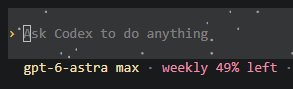

# Codex Weekly Status

[Português](README.md) · **English**

See how much of your Codex weekly limit is left, right below the message box in your terminal.



`weekly 49% left` means **49% of your weekly allowance is still available**. It updates automatically; checking the balance does not use your allowance.

## Install

Works on **Windows, macOS, and Linux**. You need:

- Codex in your terminal, signed in with a ChatGPT account that has a weekly limit.
- Node.js 20+ and Git installed.

Copy these commands into your terminal:

```sh
git clone https://github.com/08Ryanxp/codex-weekly-status.git
cd codex-weekly-status
node setup.mjs
```

Close and reopen Codex to see the indicator. To continue an existing conversation, use `codex resume`.

Your other settings are preserved.

## Remove

From the `codex-weekly-status` folder, run:

```sh
node setup.mjs --remove
```

Reopen Codex. This removes only the weekly indicator.

**Not showing up?** Check whether your weekly limit appears in `/status` and try widening your terminal.

Community project · [MIT License](LICENSE)
